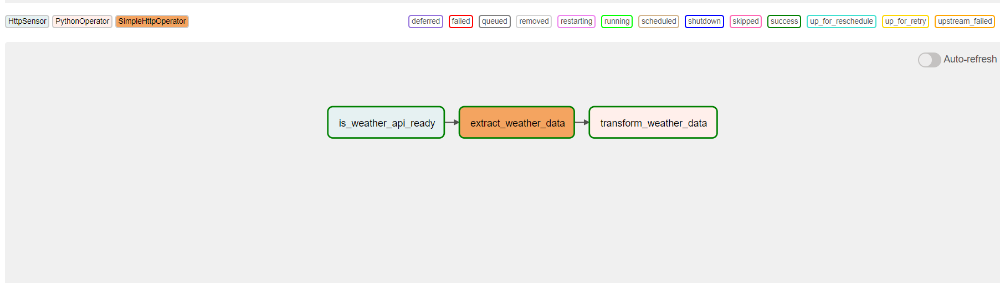

# OpenweatherAPI ETL Pipeline Using Apache Airflow

### Introduction
Built an ETL (Extract Transform Load) pipeline using OpenWeather API on AWS EC2 Instance and orchestrated it using Aache Airflow

### Architecture

